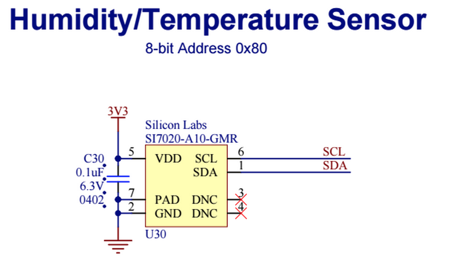

Driver for the SI7021 Temperature/Humidity Sensor
===================================

Author: [Juan Albanell](https://github.com/juanderful11/)

Driver class for a [Si7021 temperature/humidity sensor](http://www.silabs.com/Support%20Documents/TechnicalDocs/Si7021.pdf).

# Hardware
The SI7021 should be connected as follows:



#Usage

## Constructor
The instantiate a new SI7021 object you need to pass in a preconfigured I2C object, and an optional I2C base address. If no base address is supplied, the default address of 0x80 will be used:

```
hardware.i2c12.configure(CLOCK_SPEED_100_KHZ);
tempHumid <- SI7021(hardware.i2c12);
```

## SI7021.readTemp()
The **.readTemp()** method returns the temperature in degrees celsius:

```
server.log(tempHumid.readTemp() + "C");
```

## SI7021.readHumidity()
The **.readHumidity()** function returns the relative humidity (0% - 100%):

```
server.log(tempHumid.readHumidity() + "%");
```

# License
The SI7021 library is licensed under the [MIT License](./LICENSE).
